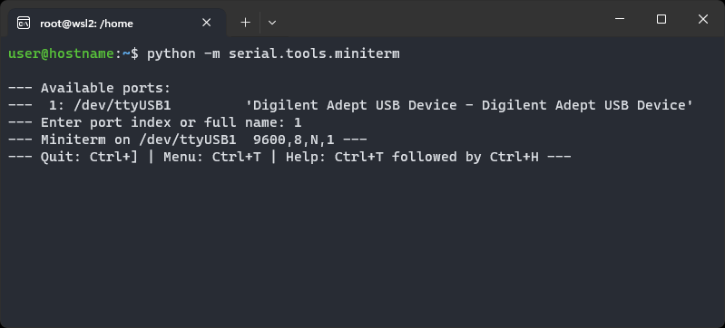

## What is RISC-V Steel?

**RISC-V Steel** is a free and open platform for embedded systems development based on the RISC-V instruction set architecture.

It features a 32-bit RISC-V processor core, a programmable memory, an UART module and an API for software development. It can be either synthesized on development boards (FPGAs) or manufactured as a custom integrated circuit (ASICs).


## The Hello World demo

The easiest way to get started with RISC-V Steel is to implement this [Hello World](https://github.com/riscv-steel/riscv-steel/tree/main/hello-world) demo on a development board and expand it to meet your system requirements. This guide will show you the steps to implement it for three boards:

* **Digilent** [**Arty A7-35T**](https://digilent.com/reference/programmable-logic/arty-a7/reference-manual)

* **Digilent** [**Arty A7-100T**](https://digilent.com/reference/programmable-logic/arty-a7/reference-manual)

* **Digilent** [**Cmod A7**](https://digilent.com/reference/programmable-logic/cmod-a7/reference-manual)

??? question "What if I don't have any of these boards?"

    If you do not have any of these boards try implementing `rvsteel-soc.v` (located at `riscv-steel/hardware/`) in your FPGA. This file contains RISC-V Steel top module.
    
    We are working to create versions of this guide for other platforms so please let us know which FPGA you use by answering our [poll](https://github.com/riscv-steel/riscv-steel/discussions/10) on GitHub.

The demo runs a Hello World program on the RISC-V processor in RISC-V Steel and uses the UART interface on the board to send a Hello World message to a computer connected to it. It allows you to get RISC-V Steel up and running in just a few steps so you can start working on your project in no time.

## Pre-requisites

To follow this guide you'll need one of the development boards listed above. Also, make sure you have the following software installed on your machine before you start:

* **AMD Xilinx Vivado**

    The latest version of AMD Xilinx Vivado is available for [download here](https://www.xilinx.com/support/download.html). During installation, remember to include support for the Artix-7 device family and the cable drivers.

* **PySerial**

    [PySerial](https://pyserial.readthedocs.io/en/latest/index.html) is a Python package for communication over serial protocol. It can be installed by running:

    ```
    $ python -m pip install pyserial
    ```

## Step by step guide

### 1. Get RISC-V Steel

* First, clone RISC-V Steel repository from GitHub:

    ```
    $ git clone https://github.com/riscv-steel/riscv-steel.git
    ```

### 2. Start a serial terminal

* Connect your development board to your computer using a USB cable.
* Start PySerial terminal by running:

    ```
    $ python -m serial.tools.miniterm
    ```

* A list with the available serial ports will follow. Select the serial port the board is connected to.

    { class="getting-started-screenshot" width="500" }

* **Keep the terminal open** for the next steps.

### 3. Program the FPGA

- Open the project at `riscv-steel/hello-world/<board-name>/hello-world.xpr` on AMD Xilinx Vivado.

- Click on *Open Hardware Manager*, located at the bottom of the *Flow Navigator*.

- Next, click on *Open Target* > *Auto Connect*.

- The FPGA will be autodetected. The hardware box will show either *xc7a35t_0* or *xc7a100t_0*. Right-click on the device name and choose *Program Device*.

- A dialog box asking you to choose a bitstream programming file will open. Choose  `hello_world_<board-name>.bit`, located at `riscv-steel/hello-world/<board-name>/`.

- Click on *Program* and wait Vivado finish programming the FPGA.

- Go back to the serial terminal window. The message below should appear:

    { class="getting-started-screenshot" width="500" }

If you've reached this point, congratulations! You now have a working instance of RISC-V Steel that you can modify to meet your project needs.

</br>
</br>
</br>
</br>
</br>